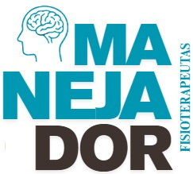

# e-ManejaDor — Versão Acessível

Versão acessível do produto educacional **e-ManejaDor**, desenvolvida com foco na acessibilidade digital para pessoas com deficiência visual.

A plataforma converte o conteúdo textual do guia educacional em formato audiobook, ampliando o acesso às informações sobre manejo da dor por meio de recursos sonoros compatíveis com diferentes dispositivos.

---

## Objetivo

Promover o acesso ao conteúdo educacional sobre manejo da dor em Unidade de Terapia Intensiva (UTI) Adulto, utilizando tecnologias digitais simples, gratuitas, responsivas e de ampla disponibilidade.

---

## Sobre o projeto

O e-ManejaDor integra o produto educacional **ManejaDor**, desenvolvido no âmbito do:

**Mestrado Profissional em Ensino em Ciências da Saúde**
Universidade Federal de São Paulo (UNIFESP)

Linha de pesquisa:

**Educação Permanente em Saúde**

O projeto busca ampliar a compreensão do manejo da dor à luz do modelo biopsicossocial, contribuindo para a formação e atualização de fisioterapeutas atuantes em UTI Adulto.

---

## Recursos da versão acessível

* Reprodução em audiobook
* Interface simplificada
* Compatibilidade com dispositivos móveis
* Layout responsivo
* Acessibilidade digital
* Código aberto
* Hospedagem gratuita via GitHub Pages®

---

## Tecnologias utilizadas

* HTML5
* CSS3
* JavaScript
* GitHub Pages®
* Canva®
* NotebookLM®
* ElevenLabs®

---

## Estrutura do projeto

e-manejador-acessivel/

├── index.html
├── style.css
├── script.js

├── img/
│ └── manejador.jpg

├── audio/
│ └── introducao.mp3

---

## Como executar

Basta abrir o arquivo:

`index.html`

em qualquer navegador compatível.

Alternativamente, o projeto pode ser acessado pela versão hospedada no GitHub Pages®.

---

## Funcionalidades

* Reprodução automática do áudio quando permitida pelo navegador
* Botão manual para iniciar o audiobook
* Efeitos visuais durante a reprodução
* Interface adaptada para acessibilidade

---

## Produto educacional

Este material integra o projeto:

**Dor e o Modelo Biopsicossocial de Saúde: investigação e elaboração de um guia para fisioterapeutas atuantes em UTI Adulto**

---

## Autor

**Edson Flavio de Sousa**

ORCID: 0000-0003-2960-6033

---

## Licença

Material educacional disponibilizado para fins acadêmicos, científicos e educacionais, sem finalidade comercial.

---

## Créditos

Recursos audiovisuais desenvolvidos com apoio das tecnologias:

* Canva®
* NotebookLM®
* ElevenLabs®

---

## Acesso digital

O e-ManejaDor encontra-se hospedado gratuitamente por meio do GitHub Pages®, permitindo ampla replicabilidade, atualização contínua e acesso facilitado por dispositivos móveis, em consonância com os princípios da acessibilidade, democratização do conhecimento e viabilidade tecnológica no contexto do Sistema Único de Saúde (SUS).

